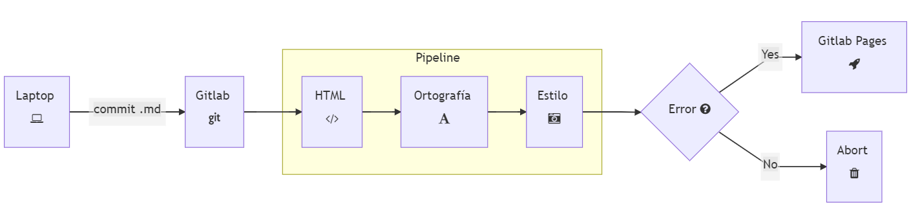

# **PosaDev 2020**

</br>
</br>
</br>
</br>

## **Documentation as Code**

### **con Gitlab y Hugo**

</br>

Enrique Cuevas

05 Diciembre 2020


<div class="page"/>

# ¿Qué es Doc as Code?

> Documentation as Code (`Docs as Code`) es un una técnica que nos dice que deberíamos escribir documentación de la misma manera en que escribimos código

* A través de `issues/merge` requests
* Usando control de versiones (Git)
* Archivos en texto plano (`Markdown`)
* Mediante colaboración y revisiones de código
* Implementando pruebas automatizadas (estilo, ortografía, links/imágenes)


<div class="page"/>

# Ventajas

* Automatizado
* Control de cambios
* Feedback inmediato
* Facilita la revisión de los cambios
* Validación de estilo y standards de escritura
* URL's e imágenes siempre funcionando.


<div class="page"/>

# Diagrama




<div class="page"/>

# Herramientas

* [Hugo](https://gohugo.io/)
* [hugo-theme-learn](https://learn.netlify.app/en/)
* Editor de Texto
* Gitlab


<div class="page"/>

# Demo

* ¿Qué vamos a ver?
* Estructura simple:

   ```text
   1. Empiece aquí
      * Instalación
         * Android
         * iOS
         * Linux
         * OSX
         * Windows
      * Configuración
   2. Ejemplos
   3. API
   4. Hacks
   ```


<div class="page"/>

# Crear Proyecto

* Crear repo `asistente` usando **pages/hugo** templates
* Clonar repo en `vscode` (configurar ssh primero)
* Abrir `gitlab-ci.yml`
* Editar `config.toml`

   ```toml
   baseurl = "https://rastangineer.gitlab.io/asistente/"
   title = "Asistente"
   ```

* Revisar `Repo Settings -> Pages` y abrir url.


<div class="page"/>

# Agregar `hugo-learn-theme`

* Agregar [hugo-learn-theme](https://themes.gohugo.io//theme/hugo-theme-learn/en) (búsqueda, soporte multi-idiomas, botones navegación, adjuntar archivos, diagramas mermaid)

   ```bash
   git submodule add https://github.com/matcornic/hugo-theme-learn.git themes/hugo-theme-learn
   ```

* Modificar `config.toml`

  ```toml
  theme = "hugo-theme-learn"
  ```

* ⚠️ El pipeline fallará porque existen algunos archivo `markdown` del tema anterior que no son compatibles con el nuevo tema. Hay que borrarlos

  ```log
  Error: Error building site: "/builds/rastangineer/asistente/content/post/2017-03-20-photoswipe-gallery-sample.md:10:1": failed to extract shortcode: template for shortcode "gallery" not found
  ```


<div class="page"/>

# Arreglar el tema

* Borrar las carpetas:
  * `content/post/`
  * `content/page/`
  * `themes/beautifulhugo`
  * `themes/Lanyon`


<div class="page"/>

# Cambiar logo

* Crear archivo `layouts/partials/logo.html` y agregar

  ```html
  <a href="/">
     
  </a>
  ```

* Copiar `logo.png` en la carpeta `static/`
* Cambiar color del tema:

   ```toml
   [Params]
      # Change default color scheme with a variant one. Can be "red", "blue", "green".
      themeVariant = "green"
   ```


<div class="page"/>

# Editar página de inicio `content/_index.md`

```markdown
# Hey Rasta

## Tu nuevo RastAsistente

* Realmente _inteligente_
* Privado. No compartimos tu información **con nadie**.
* Seguro
* Multiplataforma:
   * Android
   * iOS
   * Escritorio (Linux, Windows, Mac)
* Compatible con Siri y Google Assistant
* [Open Source](https://gitlab.com/rastangineerr/) and Free
* API
* SDK
* Hecho con amor

Dile hola a tu nuevo asistente, el **Rastasistente** 💚 💛 ❤️

### Acerca de esta documentación

Este portal fue generado con GitLab Pages / [Hugo](https://gohugo.io/) and [hugo-theme-learn](https://github.com/matcornic/hugo-theme-learn).
```


<div class="page"/>

# hugo-learn-theme

* Mejorar el `look and feel` con [Awesome Font Icons](https://fontawesome.com/icons?d=gallery&m=free)
  * ⚠️ Agregar el siguiente parámetro a `config.toml` para que los íconos se desplieguen correctamente:

    ```markdown
    [markup]
       defaultMarkdownHandler = "blackFriday"
    ```

* [Notices](https://learn.netlify.app/en/shortcodes/notice/)
* Agregar Iconos y Notices ([`content/_index.md`](content/_index.md))


<div class="page"/>

# Capitulo 1. Empiece aquí

* Crear archivo [`content/empiece-aqui/_index.md`](/content/empiece-aqui/_index.md) y agregar:

   ```markdown
   +++
   title = "Empiece aquí"
   pre = "<b>1. </b>"
   weight = 1
   chapter = true
   +++

   ## Hey Rasta!

   ### Descubra todo acerca del nuevo RastAsistente
   ```


<div class="page"/>

# Capitulo 2. Instalación

* Crear archivo [`content/empiece-aqui/instalacion/_index.md`](/content/empiece-aqui/instalacion/_index.md)

  ```markdown
  +++
  title = "Instalación"
  weight = 2
  chapter = false
  +++

  **RastAsistente** está disponible para todos los dispositivos y sistemas operativos.

  * Android <i class="fab fa-android"></i>
  * iOS <i class="fab fa-app-store-ios"></i>
  * Linux <i class="fab fa-linux"></i>
  * Windows <i class="fab fa-windows"></i>
  * OSX <i class="fab fa-apple"></i>
  ```


<div class="page"/>

# Capítulo 2. Instalación -> Android

* Crear archivo [`content/empiece-aqui/instalacion/android/_index.md`](/content/empiece-aqui/instalacion/android/_index.md)

  ```markdown
  +++
  title = 'Android'
  weight = 2
  chapter = false
  +++
  # <i class="fab fa-android"></i>
  
  
  ```


<div class="page"/>

# Resto de capitulos

## **Ejemplos**

## **API**

## **Hacks**


<div class="page"/>

# Reorganizar Pipeline

```yml
image: registry.gitlab.com/pages/hugo:latest
variables:
  GIT_SUBMODULE_STRATEGY: recursive

stages:
  - build
  - deploy

generarHTML:
  stage: build
  script:
    - hugo -d test
  artifacts:
    paths:
    - test

pages:
  stage: deploy
  script:
    - hugo
  artifacts:
    paths:
    - public
  only:
  - master
```


<div class="page"/>

# Pipeline: Validar estilo y consistencia

* Se encarga de revisar el **estilo** de redacción, **standards** y **consistencia** de los archivos `Markdown`
* Agregar el siguiente código a `.gitlab-ci.yml`

  ```yaml
  markdownlint:
    stage: test
    variables:
      markdownlint_cli_version: "0.22.0"
    image: peterdavehello/markdownlint:$markdownlint_cli_version
    script:
      - markdownlint content/
  ```


<div class="page"/>

# Pipeline: Validar estilo y consistencia (Fix)

* Crear archivo `.markdownlint.yml` y habilitar/deshabilitar reglas

  ```yml
  {
  "default": true,
  "MD013": false, # Line length [Expected: 80; Actual: 90]
  "MD033": false, # Inline HTML [Element: i]
  "MD025": false, # Multiple top level headings in the same document
  "MD026": false, # Trailing punctuation in heading [Punctuation: '!']
  "MD014": false # Dollar signs used before commands without showing output [Context: "$ sudo apt-get update"]
  }
  ```


<div class="page"/>

# Pipeline: Revisión Ortográfica

* Se encarga de buscar errores ortográficos en los archivos Markdown
* Agregar el siguiente código a `.gitlab-ci.yml`

  ```yaml
  spellcheck:
    stage: test
    image: tmaier/hunspell
    script:
      - wget http://download.services.openoffice.org/contrib/dictionaries/es_MX.zip
      - unzip es_MX.zip
      - cp *.aff *.dic /usr/share/hunspell
      - export HUNSPELL_FINDINGS=`hunspell -d es_MX,en_US -p .spelling -u3 -H test/**/*.html | sort | uniq`
      - echo "$HUNSPELL_FINDINGS"
      - test "$HUNSPELL_FINDINGS" == ""
  ```


<div class="page"/>

# Pipeline: Revisión Ortográfica (Fix)

* Crear `.spelling` y personalizar diccionario

  ```text
  RastAsisterasta
  RastAsistente
  iOS
  OSX
  png
  Grav
  API
  AYBABTU
  ```


<div class="page"/>

# Pipeline: Validar HTML

* Entre otras cosas, valida:
  * Imágenes (alt tags, internal broken refs, external imgs, )
  * Links (external/internal broken links, internal hash references, )
  * Scripts (internal refs, external loading)
  * Favicon
* Agregar el siguiente código a `.gitlab-ci.yml`

  ```yaml
  htmlproofer:
    image: 18fgsa/html-proofer:gitlab-ci
    script:
      - htmlproofer test --empty-alt-ignore --allow-hash-href
  ```

* ⚠️ El pipeline fallará porque una URL no es válida. Corregir y continuar


<div class="page"/>

# Casos de uso

* Blogs ([Rastangineer Blog](https://rastangineer.github.io/blog/))
* Documentación de Sotware/Productos/Servicios
* Tutoriales
* Libros/Cuentos ([Cuentos Pachecos](https://cuentospachecos.netlify.app/))
* Diarios
* Etc..
* CV online


<div class="page"/>

# Q & A

* PDFs?
* Soporte para comentarios? Discuss, Github issues
