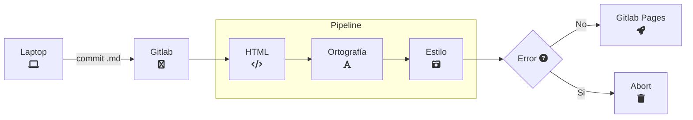

## Documentation as Code

* A través de `issues/merge` requests
* Usando control de versiones (Git)
* Archivos en texto plano (`Markdown`)
* Mediante colaboración y revisiones de código
* Implementando pruebas automatizadas (estilo, ortografía, links/imágenes)

---

## Ventajas

* Automatizado
* Control de cambios
* Feedback inmediato
* Facilita la revisión de los cambios
* Validación de estilo y standards de escritura
* URL's e imágenes siempre funcionando.

---

## Diagrama



---

## Herramientas

* Hugo
* hugo-theme-learn
* Editor de Texto
* Gitlab

---

## Demo

* ¿Que vamos a ver?
* Estructura simple:

   ```text
   1. Empiece aquí
      * Instalación
         * Android
         * iOS
         * Linux
         * OSX
         * Windows
      * Configuración
   2. Ejemplos
   3. API
   4. Hacks
   ```
